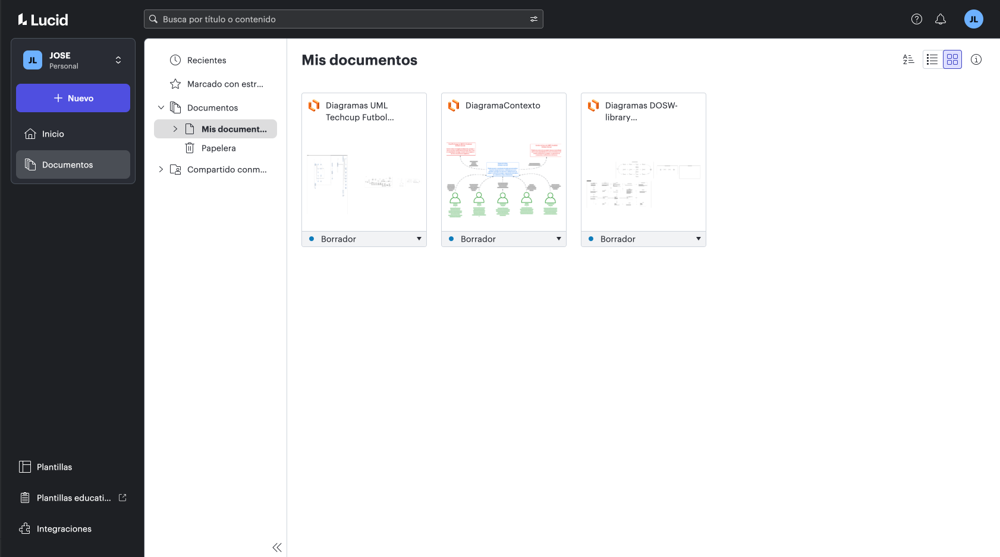
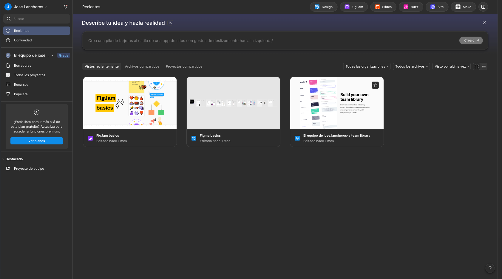

# DOSW_ParcialT2_JoseLancheros

**Estudiante:** Jose Luis Lancheros Ayora
**Grupo:** 1
**Materia:** Desarrollo y Operaciones de Software
**Fecha:** Abril 2026

## LucidChart

## Figma

## Teoria

## punto 1
## funcionalidad numero 1
#### ¿que hace? permite crear una cuenta nueva
#### A) Verbo HTTP es el POST porque esta creando un recuerso nuevo que en este caso es un usuario
#### B) no es idempotente,
#### C) Razon tecnica:  porque si enviamos el mismo POST varias veces puede intentar crear el usuario varias veces aunque el sistema lo bloquee por correo repetido la intencion como tal no es idempotente
#### D) Rol con acceso publico o usuario no autenticado
#### E) **Datos de entrada:**
    fullname: String
    email: String 
    password: String
    role: String
#### **Datos de salida**
    Id: long 
    fullName: String 
    email: String 
    role: String 
    createdAt: DateTime 

#### F) ejemplo
    {
    "fullName": "Jose Lancheros",
    "email": "jose.lancheros@eci.edu.co",
    "password": "Segura123"
    }

Response 201 Created:

    {
      "id": "1",
      "fullName": "Jose Lancheros",
      "email": "jose.lancheros@eci.edu.co",
      "role": "CLIENT",
      "createdAt": "2026-04-10"
    }

#### G) **Validaciones de input:**
- fullName: no vacío, máximo 100 caracteres
- email: formato válido, debe terminar en dominio institucional
- password: mínimo 8 caracteres, al menos una mayúscula y un número

**Validaciones de negocio:**
    - El correo no debe estar registrado previamente
    - La contraseña se almacena cifrada con BCrypt, nunca en texto plano

#### H) **Códigos HTTP:**

#### para cada camino identificamos los siguentes errores teniendo en cuenta que 200 es de exito, 400 error del usuario y 500 errores del servidor:

Happy Path:  201  
Email ya registrado: 409  
Campos inválidos: 400 
Error del servidor: 500  

## funcionalidad numero 2 
#### ¿que hace? Autentificacion o login valida credenciales y devuelve el acceso al sistema
#### A) Verbo HTTP  POST
#### B) no es idempotente
#### C) razon tecnica:  Genera un nuevo token JWT en cada llamada. Aunque el input sea igualito, la salida varía por el claim iat, rompiendo la idempotencia.
#### D) Rol con accesso publico o usuario no autenticado 
#### E) datos de entrada:
    {
    email: String 
    password:  String 
    }
#### datos de salida: 
    {
    token: String
    expiresIn: Long 
    userId: ID 
    role: String 
    }
#### F) ejemplo:
    {
    email: jose.lancherosQeci.edu.co
    password: "segura123"
    }

Response 200 OK:

    {
      "token": "1",
      "expiresIn": 3600,
      "userId": "1",
      "role": "CLIENT"
    }
#### G) Validaciones de input:
    - email y password no vacíos
    - email con formato válido

#### **Validaciones de negocio:**
    - El usuario debe existir en el sistema
    - La contraseña ingresada debe coincidir con la almacenada
    - El usuario debe estar activo
#### H) codigos HTTP: para cada camino identificamos los siguentes errores teniendo en cuenta que 200 es de exito, 400 error del usuario y 500 errores del servidor:
    Happy Path: 200 
    Credenciales inválidas: 401 
    Campos vacíos: 400 

## funcionalidad numero 3
#### ¿que hace?: consultar producto por qr
#### A) Verbo HTTP GET
#### b) Si es idempotente
#### C) razon tecnica: Es una operación de solo lectura. Llamarla N veces con el mismo código QR retorna el mismo resultado sin modificar el estado del servidor.
#### D) Roles con acceso client y el administrador
#### E) datos de entrada
     qrCode (path) String
#### datos de salida
     id: long
     name: String 
     description:  String 
     price:  BigDecimal 
     qrCode:  String 
     stock: Integer 
     status; String 
#### F) ejemplo:
    Response 200 OK:

    {
      "id": Long,
      "name": "Café Americano",
      "description": "Café negro sin azúcar",
      "price": 2500,
      "qrCode": "CAFE-001",
      "stock": 500,
      "status": "AVAILABLE"
    }
#### G) Validaciones de input:
    - qrCode no vacío
#### Validaciones de negocio:
    - El producto debe existir con ese código QR
    - El producto debe estar en estado AVAILABLE
#### H) codigos HTTP
    Happy Path: 200  
    QR no encontrado: 404  
    Producto no disponible:  404 
    No autenticado: 401 
## funcionalidad numero 4 
#### ¿que hace?: crear un pedido por un cliente
#### A) verbo HTTP POST
#### B) no es idempotente
#### C) razon tecnica: Cada llamada crea un nuevo pedido en la base de datos y modifica el estado del sistema. Dos llamadas idénticas generarían dos pedidos o un conflicto.
#### D) Rol de acceso el de client
#### E) datos de entrada
    items  List\<OrderItemRequest\> 
    items[].qrCode  String 
    items[].quantity  Integer
#### datos de dalida
     id:LONG
     userId:LONG 
     items: List\<OrderItemResponse\> 
     status: String
     total: BigDecimal 
     createdAt: DateTime
#### F) ejemplo
    {
    "items": [
    { "qrCode": "CAFE-001", "quantity": 2 },
    { "qrCode": "SAND-003", "quantity": 1 }
    
    
    

#### Response 201 Created:

    {
      "id": Long,
      "userId": Long,
      "items": [
        {
          "productId": "1",
          "productName": "Café Americano",
          "quantity": 2,
          "unitPrice": 2500.00,
          "subtotal": 5000.00
        },
        {
          "productId": "2",
          "productName": "Sándwich de Pollo",
          "quantity": 1,
          "unitPrice": 8000.00,
          "subtotal": 8000.00
        }
      ],
      "status": "CREADO",
      "total": 13000.00,
      "createdAt": "2026-04-10"
    }
#### G) Validaciones de input:
     - items no puede estar vacío
      - quantity debe ser mayor a 0 para cada ítem
      - qrCode no vacío
    
#### Validaciones de negocio:
     - El usuario no puede tener un pedido activo (CREADO o EN_PREPARACION)
      - Cada producto debe existir y estar en estado AVAILABLE
      - El stock disponible debe ser suficiente para la cantidad solicitada
      - El total se calcula automáticamente en el servidor
      - El pedido inicia siempre en estado CREADO
#### H) codigos HTTP
     Happy Path: 201 
     Ya tiene pedido activo: 409 
     Stock insuficiente: 409 
     Producto no encontrado:  404 
     Lista vacía: 400 
     No autenticado: 401 
     Sin permisos: 403 
## funcionalidad numero 5 
#### ¿que hace? cambiar el estado del pedido por el administrador
#### A) Verbo HTTP PATCH
#### B) si es idempotente
#### C) razon tecnica: Llamar PATCH con status: EN_PREPARACION dos veces deja el pedido en ese mismo estado. El resultado final es el mismo sin importar cuántas veces se llame con el mismo valor
#### D) Roles de acceso el del administrador
#### E) datos de entrada
     orderId (path):long
     status (body): String
#### datos de salida
    id: long
    status: String 
    updatedAt:DateTime
#### F) ejemplo
    {
    "status": "EN_PREPARACION"
    }

Response 200 :

    {
      "id": "1",
      "status": "EN_PREPARACION",
      "updatedAt": "2026-04-10"
    }
#### G) Validaciones de input:
    - status solo acepta los valores EN_PREPARACION o ENTREGADO

#### Validaciones de negocio:
    - El pedido debe existir
    - Las transiciones válidas son: CREADO  EN_PREPARACION  ENTREGADO
    - No se puede retroceder un estado ( de ENTREGADO a EN_PREPARACION)
    - Al pasar a ENTREGADO se descuenta el stock de los productos

#### H) codigos HTTP
    Happy Path: 200 
     Pedido no encontrado: 404 
     Transición inválida: 409 
     Valor inválido: 400 
     Sin permisos: 403 
## funcionmalidad numero 6 
#### ¿que hace? cancelar un pedido ya existente
#### A) verbo PATCH
#### B) si es idempotente
#### C) razon tecnica: Cancelar un pedido ya cancelado produce el mismo estado final. La segunda llamada puede devolver un error 409 de ya cancelado pero el estado del sistema no cambia
#### D) roles con acceso el del client
#### E) datos de entrada
    orderId (path): long

#### Datos de salida:
     id: long 
     status: String 
     updatedAt: DateTime 
#### F) ejemplo
    Response 200 OK:

    {
      "id": "1",
      "status": "CANCELADO",
      "updatedAt": "2026-04-10"
    }

#### G) Validaciones de input:
    - orderId válido en el path

#### Validaciones de negocio:
    - El pedido debe existir
    - Solo se puede cancelar si el estado es CREADO
    - El cliente solo puede cancelar sus propios pedidos
    - No se restaura el stock al cancelar el stock se descuenta al confirmar, no al crear
#### H)  codigos HTTP
    Happy Path: 200  
    Pedido no en CREADO: 409  
    Pedido no encontrado: 404 
    Pedido de otro usuario: 403 
## FUNCIONALIDAD NUMERO 7
#### ¿que hace? confirmar un pedido y actualizar stock
#### A) Verbo PATCH
#### B) si es idempotente
#### C) razon tecnica: Esta acción ocurre internamente como parte de la transición a ENTREGADO de F05. Marcar un pedido como ENTREGADO dos veces no descuenta el stock dos veces porque la segunda llamada encuentra el estado ya en ENTREGADO y no es correcta la validación de cambio.
#### D) roles con acceso: administrador
#### E) datos de entrada : esta funcion se ejecuta internamente con la funcionalidad numero 5 
#### F) 
#### G) Validaciones de negocio:
    - Verificar stock disponible antes de confirmar
    - Si el stock es insuficiente para algún producto al momento de entregar, el estado no cambia y se notifica el error
#### H) codigos HTTP
    Happy Path: 200 
    Stock insuficiente: 409 