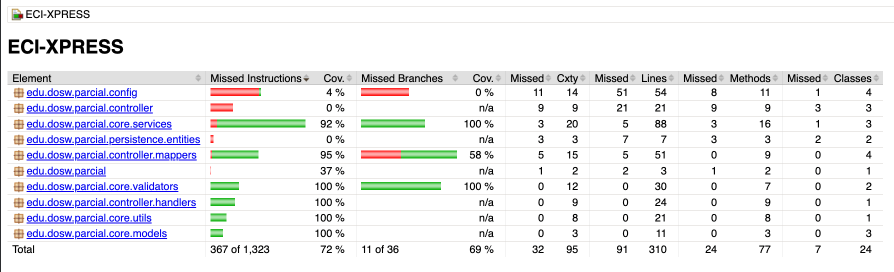
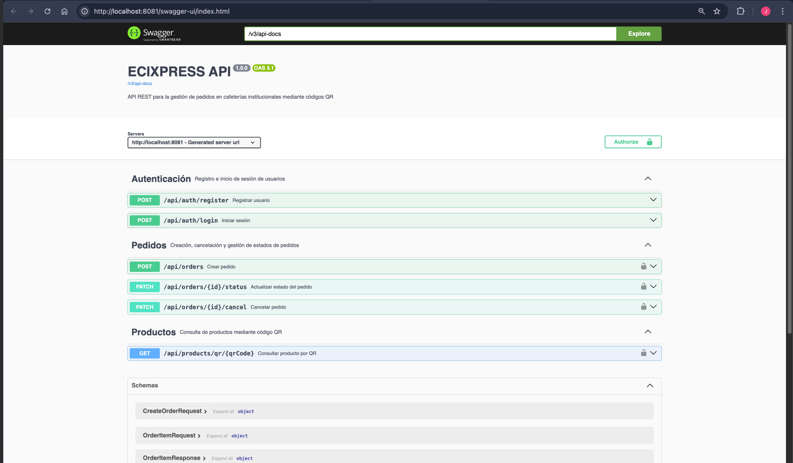
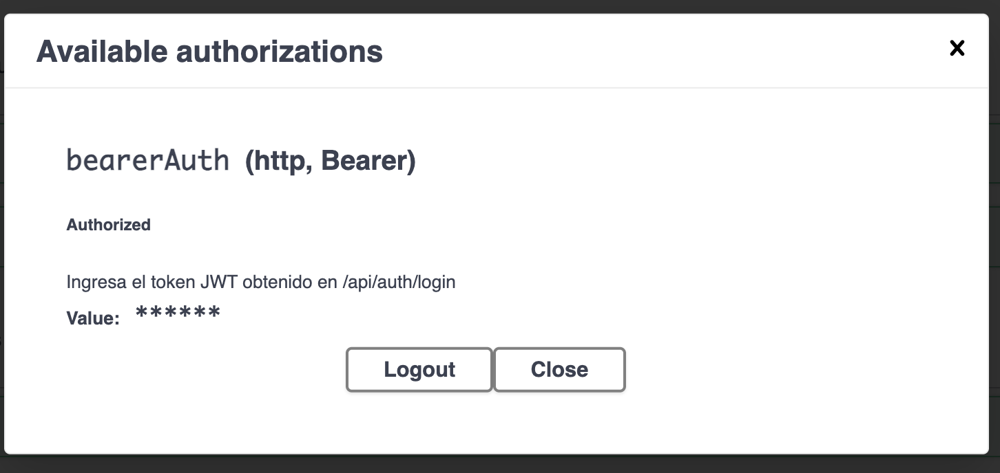
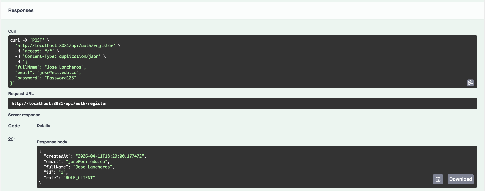
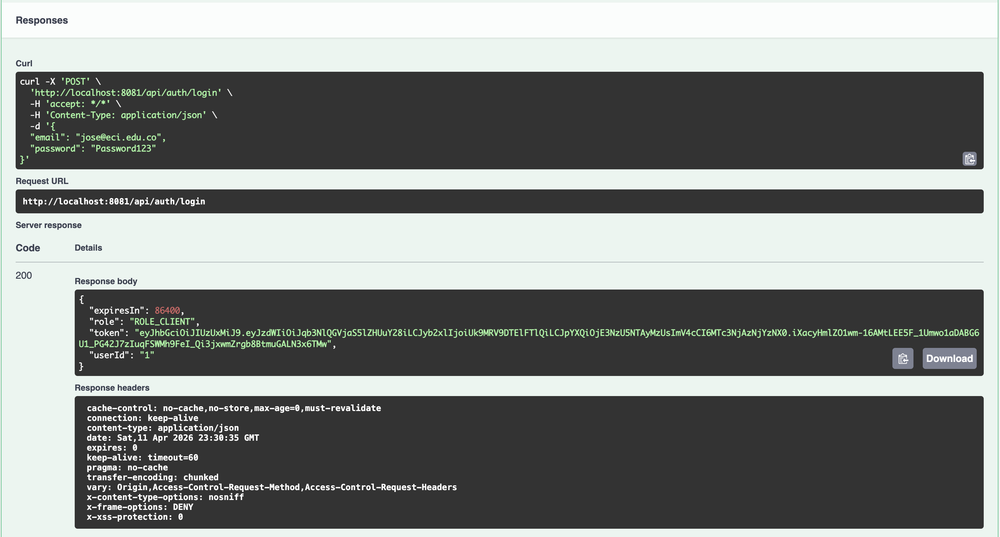
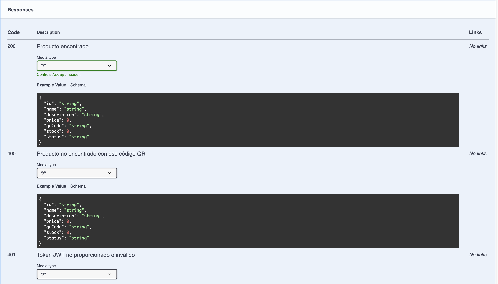
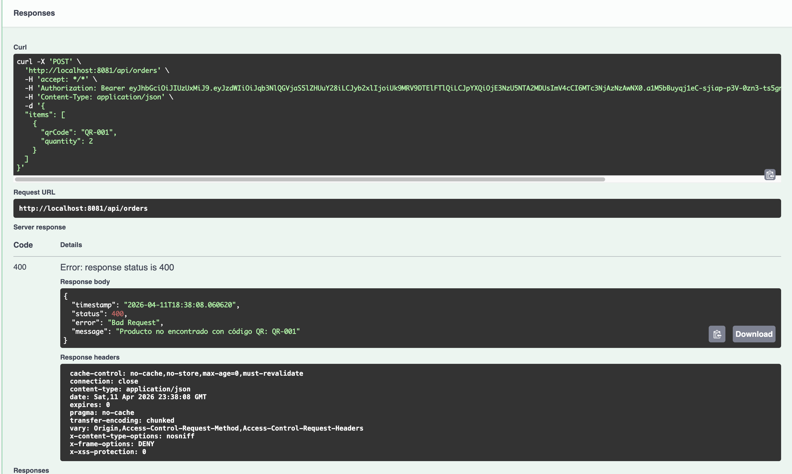
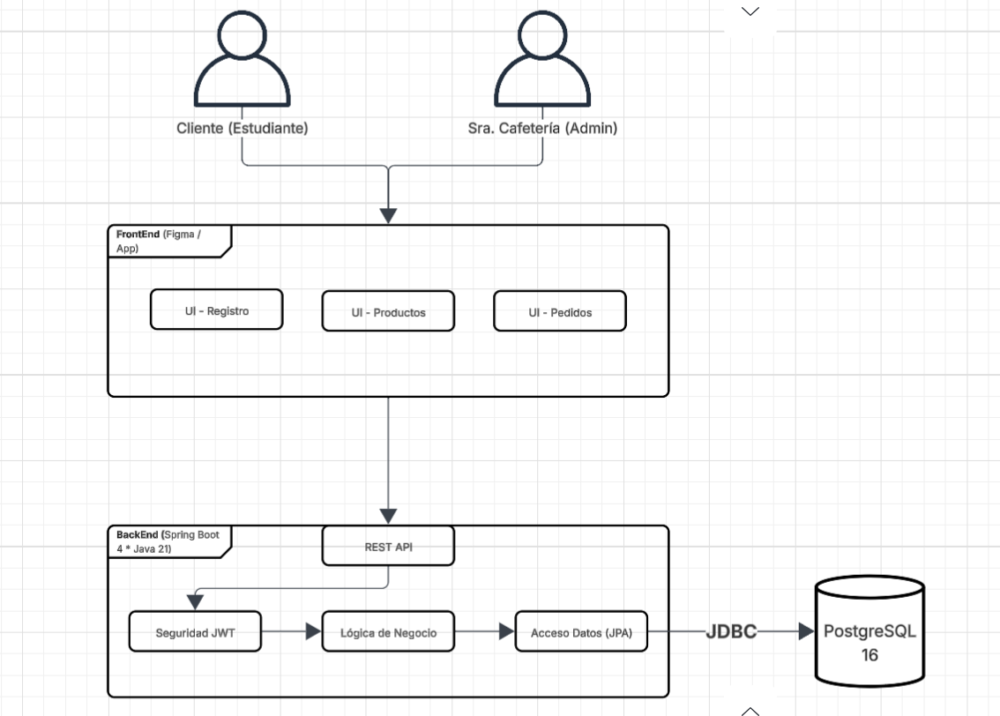

# ECIXPRESS — Sistema de Pedidos de Cafetería

**Estudiantes:** Jose Luis Lancheros Ayora, Dana Valeria Leal Guzmán y Juan Sebastián Murcia Yanquen
**Grupo:** 1
**Materia:** Desarrollo y Operaciones de Software
**Fecha:** Abril 2026

---

## Descripción

ECIXPRESS es un backend REST para la gestión de pedidos de la cafetería universitaria. Permite a los clientes registrarse, autenticarse, consultar productos por código QR y crear/cancelar pedidos. La señora de la cafetería puede cambiar el estado de los pedidos (CREADO → EN_PREPARACION → ENTREGADO).

**Stack:**
- Java 21
- Spring Boot 4.0.5
- Spring Security (JWT)
- MapStruct
- JPA/PostgreSQL
- Springdoc OpenAPI

---

## Levantar el proyecto

### 1. Base de datos (Docker)

```bash
docker compose up -d
```

### 2. Aplicación

```bash
mvn spring-boot:run
```

La API queda disponible en `http://localhost:8081`.
Swagger UI: `http://localhost:8081/swagger-ui.html`

---

## Arquitectura y estructura

```
src/main/java/edu/dosw/parcial/
├── config/          # SecurityConfig, CorsConfig, SwaggerConfig
├── controller/
│   ├── dtos/        # Request y Response DTOs
│   ├── handlers/    # GlobalExceptionHandler
│   └── mappers/     # MapStruct: UserMapper, ProductMapper, OrderMapper, OrderItemMapper
├── core/
│   ├── models/      # Enums: OrderStatus, ProductStatus, UserRole
│   ├── services/    # AuthService, OrderService, ProductService
│   ├── utils/       # JwtUtil
│   └── validators/  # StockValidator, OrderStateValidator
└── persistence/
    ├── entities/    # UserEntity, ProductEntity, OrderEntity, OrderItemEntity
    └── repositories/
```

---

## Endpoints

| Método | Ruta                        | Rol requerido       | Descripción               |
|--------|-----------------------------|---------------------|---------------------------|
| POST   | `/api/auth/register`        | Público             | Registro de usuario       |
| POST   | `/api/auth/login`           | Público             | Login — devuelve JWT      |
| GET    | `/api/products/qr/{qrCode}` | Autenticado         | Consultar producto por QR |
| POST   | `/api/orders`               | ROLE_CLIENT         | Crear pedido              |
| PATCH  | `/api/orders/{id}/cancel`   | ROLE_CLIENT         | Cancelar pedido           |
| PATCH  | `/api/orders/{id}/status`   | ROLE_CAFETERIA_LADY | Cambiar estado del pedido |

---

## Seguridad

- Autenticación **stateless** con JWT (HS256, 24h)
- Header: `Authorization: Bearer <token>`
- Rutas públicas: `/api/auth/**`, `/swagger-ui/**`, `/v3/api-docs/**`
- `@PreAuthorize` en controllers para control de roles

---

## Pruebas unitarias

45 tests · 0 fallos · cobertura de línea: **72.3%** (mínimo requerido: 70%)

| Suite                           | Tests |
|---------------------------------|-------|
| `AuthServiceTest`               | 5     |
| `OrderServiceTest`              | 8     |
| `StockValidatorTest`            | 5     |
| `OrderStateValidatorTest`       | 9     |
| `JwtUtilTest`                   | 8     |
| `MapperTest`                    | 4     |
| `GlobalExceptionHandlerTest`    | 5     |
| `DoswParcialT2ApplicationTests` | 1     |

```bash
mvn test                  # ejecutar tests
mvn verify                # tests + check de cobertura Jacoco
mvn jacoco:report         # generar reporte HTML en target/site/jacoco/index.html
```

---

## Reporte de cobertura Jacoco

> Cobertura total de líneas: **72%** supera el umbral del 70%.



---

## Swagger UI

> Documentación interactiva disponible en `http://localhost:8081/swagger-ui.html`.
> Autenticarse con el botón **Authorize** pegando el JWT obtenido del endpoint `/api/auth/login`.




---

## Diagramas

### Arquitectura / Componentes

[Ver en LucidChart](https://lucid.app/lucidchart/5f749f8d-4f0e-4f93-bbd4-d11261856dde/edit?viewport_loc=-3175%2C-969%2C10144%2C5113%2C0_0&invitationId=inv_7272ad09-6f3a-4530-80d9-12706f98182e)


### Diseños de interfaz (Figma)

[Ver en Figma](https://www.figma.com/proto/WJZ1VmPNrYJmA6uL27ftHQ/Parcial-2T---Dana-Leal?node-id=19-517&p=f&t=WdSi16gHOLRNkguB-1&scaling=scale-down&content-scaling=fixed&page-id=0%3A1&starting-point-node-id=19%3A517)


---

## Pruebas funcionales — Happy Path

### 1. Registro de usuario

**Request:** POST /api/auth/register



---

### 2. Login

**Request:** POST /api/auth/login



---

### 3. Consultar producto por QR



---

### 4. Crear pedido

**Request:** POST /api/orders



---

## Flujos de error

| Escenario                     | Código           | Mensaje                                 |
|-------------------------------|------------------|-----------------------------------------|
| Email ya registrado           | 409 Conflict     | `Ya existe un usuario con ese email`    |
| Credenciales incorrectas      | 400 Bad Request  | `Credenciales inválidas`                |
| Producto no encontrado        | 400 Bad Request  | `Producto no encontrado`                |
| Sin stock suficiente          | 400 Bad Request  | `Stock insuficiente para el producto`   |
| Pedido activo existente       | 409 Conflict     | `El usuario ya tiene un pedido activo`  |
| Pedido no encontrado          | 400 Bad Request  | `Pedido no encontrado`                  |
| Transición de estado inválida | 409 Conflict     | `Transición inválida`                   |
| Token inválido / ausente      | 401 Unauthorized | —                                       |
| Rol insuficiente              | 403 Forbidden    | —                                       |
| Error de validación de campos | 400 Bad Request  | `Error de validación` + lista de campos |

---

## SonarQube (análisis estático)

```bash
# SonarQube corriendo localmente en localhost:9000
mvn sonar:sonar \
  -Dsonar.projectKey=ecixpress \
  -Dsonar.host.url=http://localhost:9000 \
  -Dsonar.token=<tu-token>
```

---

# PARTE TEÓRICA

## punto 1
## funcionalidad numero 1
#### ¿que hace? permite crear una cuenta nueva
#### A) Verbo HTTP es el POST porque esta creando un recuerso nuevo que en este caso es un usuario
#### B) no es idempotente,
#### C) Razon tecnica:  porque si enviamos el mismo POST varias veces puede intentar crear el usuario varias veces aunque el sistema lo bloquee por correo repetido la intencion como tal no es idempotente
#### D) Rol con acceso publico o usuario no autenticado
#### E) **Datos de entrada:**
    fullname: String
    email: String 
    password: String
    role: String
#### **Datos de salida**
    Id: long 
    fullName: String 
    email: String 
    role: String 
    createdAt: DateTime 

#### F) ejemplo
    {
    "fullName": "Jose Lancheros",
    "email": "jose.lancheros@eci.edu.co",
    "password": "Segura123"
    }


Response 201 Created:

    {
      "id": "1",
      "fullName": "Jose Lancheros",
      "email": "jose.lancheros@eci.edu.co",
      "role": "CLIENT",
      "createdAt": "2026-04-10"
    }

#### G) **Validaciones de input:**
- fullName: no vacío, máximo 100 caracteres
- email: formato válido, debe terminar en dominio institucional
- password: mínimo 8 caracteres, al menos una mayúscula y un número

**Validaciones de negocio:**
    - El correo no debe estar registrado previamente
    - La contraseña se almacena cifrada con BCrypt, nunca en texto plano

#### H) **Códigos HTTP:**

#### para cada camino identificamos los siguentes errores teniendo en cuenta que 200 es de exito, 400 error del usuario y 500 errores del servidor:

Happy Path:  201  
Email ya registrado: 409  
Campos inválidos: 400 
Error del servidor: 500  

## funcionalidad numero 2 
#### ¿que hace? Autentificacion o login valida credenciales y devuelve el acceso al sistema
#### A) Verbo HTTP  POST
#### B) no es idempotente
#### C) razon tecnica:  Genera un nuevo token JWT en cada llamada. Aunque el input sea igualito, la salida varía por el claim iat, rompiendo la idempotencia.
#### D) Rol con accesso publico o usuario no autenticado 
#### E) datos de entrada:
    {
    email: String 
    password:  String 
    }
#### datos de salida: 
    {
    token: String
    expiresIn: Long 
    userId: ID 
    role: String 
    }
#### F) ejemplo:
    {
    email: jose.lancherosQeci.edu.co
    password: "segura123"
    }

Response 200 OK:

    {
      "token": "1",
      "expiresIn": 3600,
      "userId": "1",
      "role": "CLIENT"
    }
#### G) Validaciones de input:
    - email y password no vacíos
    - email con formato válido

#### **Validaciones de negocio:**
    - El usuario debe existir en el sistema
    - La contraseña ingresada debe coincidir con la almacenada
    - El usuario debe estar activo
#### H) codigos HTTP: para cada camino identificamos los siguentes errores teniendo en cuenta que 200 es de exito, 400 error del usuario y 500 errores del servidor:
    Happy Path: 200 
    Credenciales inválidas: 401 
    Campos vacíos: 400 

## funcionalidad numero 3
#### ¿que hace?: consultar producto por qr
#### A) Verbo HTTP GET
#### b) Si es idempotente
#### C) razon tecnica: Es una operación de solo lectura. Llamarla N veces con el mismo código QR retorna el mismo resultado sin modificar el estado del servidor.
#### D) Roles con acceso client y el administrador
#### E) datos de entrada
     qrCode (path) String
#### datos de salida
     id: long
     name: String 
     description:  String 
     price:  BigDecimal 
     qrCode:  String 
     stock: Integer 
     status; String 
#### F) ejemplo:
    Response 200 OK:

    {
      "id": Long,
      "name": "Café Americano",
      "description": "Café negro sin azúcar",
      "price": 2500,
      "qrCode": "CAFE-001",
      "stock": 500,
      "status": "AVAILABLE"
    }
#### G) Validaciones de input:
    - qrCode no vacío
#### Validaciones de negocio:
    - El producto debe existir con ese código QR
    - El producto debe estar en estado AVAILABLE
#### H) codigos HTTP
    Happy Path: 200  
    QR no encontrado: 404  
    Producto no disponible:  404 
    No autenticado: 401 
## funcionalidad numero 4 
#### ¿que hace?: crear un pedido por un cliente
#### A) verbo HTTP POST
#### B) no es idempotente
#### C) razon tecnica: Cada llamada crea un nuevo pedido en la base de datos y modifica el estado del sistema. Dos llamadas idénticas generarían dos pedidos o un conflicto.
#### D) Rol de acceso el de client
#### E) datos de entrada
    items  List\<OrderItemRequest\> 
    items[].qrCode  String 
    items[].quantity  Integer
#### datos de dalida
     id:LONG
     userId:LONG 
     items: List\<OrderItemResponse\> 
     status: String
     total: BigDecimal 
     createdAt: DateTime
#### F) ejemplo
    {
    "items": [
    { "qrCode": "CAFE-001", "quantity": 2 },
    { "qrCode": "SAND-003", "quantity": 1 }
    

#### Response 201 Created:

    {
      "id": Long,
      "userId": Long,
      "items": [
        {
          "productId": "1",
          "productName": "Café Americano",
          "quantity": 2,
          "unitPrice": 2500.00,
          "subtotal": 5000.00
        },
        {
          "productId": "2",
          "productName": "Sándwich de Pollo",
          "quantity": 1,
          "unitPrice": 8000.00,
          "subtotal": 8000.00
        }
      ],
      "status": "CREADO",
      "total": 13000.00,
      "createdAt": "2026-04-10"
    }
#### G) Validaciones de input:
     - items no puede estar vacío
      - quantity debe ser mayor a 0 para cada ítem
      - qrCode no vacío
    
#### Validaciones de negocio:
     - El usuario no puede tener un pedido activo (CREADO o EN_PREPARACION)
      - Cada producto debe existir y estar en estado AVAILABLE
      - El stock disponible debe ser suficiente para la cantidad solicitada
      - El total se calcula automáticamente en el servidor
      - El pedido inicia siempre en estado CREADO
#### H) codigos HTTP
     Happy Path: 201 
     Ya tiene pedido activo: 409 
     Stock insuficiente: 409 
     Producto no encontrado:  404 
     Lista vacía: 400 
     No autenticado: 401 
     Sin permisos: 403 
## funcionalidad numero 5 
#### ¿que hace? cambiar el estado del pedido por el administrador
#### A) Verbo HTTP PATCH
#### B) si es idempotente
#### C) razon tecnica: Llamar PATCH con status: EN_PREPARACION dos veces deja el pedido en ese mismo estado. El resultado final es el mismo sin importar cuántas veces se llame con el mismo valor
#### D) Roles de acceso el del administrador
#### E) datos de entrada
     orderId (path):long
     status (body): String
#### datos de salida
    id: long
    status: String 
    updatedAt:DateTime
#### F) ejemplo
    {
    "status": "EN_PREPARACION"
    }


Response 200 :

    {
      "id": "1",
      "status": "EN_PREPARACION",
      "updatedAt": "2026-04-10"
    }
#### G) Validaciones de input:
    - status solo acepta los valores EN_PREPARACION o ENTREGADO

#### Validaciones de negocio:
    - El pedido debe existir
    - Las transiciones válidas son: CREADO  EN_PREPARACION  ENTREGADO
    - No se puede retroceder un estado ( de ENTREGADO a EN_PREPARACION)
    - Al pasar a ENTREGADO se descuenta el stock de los productos

#### H) codigos HTTP
    Happy Path: 200 
     Pedido no encontrado: 404 
     Transición inválida: 409 
     Valor inválido: 400 
     Sin permisos: 403 
## funcionmalidad numero 6 
#### ¿que hace? cancelar un pedido ya existente
#### A) verbo PATCH
#### B) si es idempotente
#### C) razon tecnica: Cancelar un pedido ya cancelado produce el mismo estado final. La segunda llamada puede devolver un error 409 de ya cancelado pero el estado del sistema no cambia
#### D) roles con acceso el del client
#### E) datos de entrada
    orderId (path): long

#### Datos de salida:
     id: long 
     status: String 
     updatedAt: DateTime 
#### F) ejemplo
    Response 200 OK:

    {
      "id": "1",
      "status": "CANCELADO",
      "updatedAt": "2026-04-10"
    }

#### G) Validaciones de input:
    - orderId válido en el path

#### Validaciones de negocio:
    - El pedido debe existir
    - Solo se puede cancelar si el estado es CREADO
    - El cliente solo puede cancelar sus propios pedidos
    - No se restaura el stock al cancelar el stock se descuenta al confirmar, no al crear
#### H)  codigos HTTP
    Happy Path: 200  
    Pedido no en CREADO: 409  
    Pedido no encontrado: 404 
    Pedido de otro usuario: 403 
## FUNCIONALIDAD NUMERO 7
#### ¿que hace? confirmar un pedido y actualizar stock
#### A) Verbo PATCH
#### B) si es idempotente
#### C) razon tecnica: Esta acción ocurre internamente como parte de la transición a ENTREGADO de F05. Marcar un pedido como ENTREGADO dos veces no descuenta el stock dos veces porque la segunda llamada encuentra el estado ya en ENTREGADO y no es correcta la validación de cambio.
#### D) roles con acceso: administrador
#### E) datos de entrada : esta funcion se ejecuta internamente con la funcionalidad numero 5 
#### F) 
#### G) Validaciones de negocio:
    - Verificar stock disponible antes de confirmar
    - Si el stock es insuficiente para algún producto al momento de entregar, el estado no cambia y se notifica el error
#### H) codigos HTTP
    Happy Path: 200 
    Stock insuficiente: 409 

## punto numero 2 
#### La diferencia clave es que las validaciones de input ocurren antes de tocar la lógica de negocio y se pueden verificar sin algo externo, mientras que las validacines de negocio requieren conocer el contexto del sistema para poder validarse.

## punto numero 3 
#### autenticacion es el proceso de verificar la identidad de un usuario, es decir, confirmar que alguien es quien dice ser. 
#### Autorización es el proceso de verificar qué acciones puede realizar un usuario ya autenticado.

#### Integridad es la garantía de que los datos no han sido alterados o corrompidos durante su almacenamiento o transmisión. 

## punto 4 
#### diagrama de componentes


## punto 5 
#### Cuando las capas de un proyecto no están bien separadas surgen varios problemas graves como los siguientes

    Acoplamiento alto
    Imposibilidad de testear unitariamente
    Violación del principio de responsabilidad única (SRP) 
    Lógica de negocio duplicada 
    Dificultad para escalar 

## punto 6
#### diagrama de componentes especificos

## punto 7 
#### Diferencia entre Validador, Utilidad y Servicio
    Validador es un componente que como única responsabilidad tiene que verificar que una condición del sistema o del input es válida
    Utilidad es una clase con métodos estáticos o que no tienen lógica de negocio ni acceso a la base de datos. 
    Servicio es el componente central de la lógica de negocio. almacena la ejecución de un caso de uso completo

## punto 8 
#### Diagrama de Clases y Patrón de Estados

### Patrón de software para los estados del pedido:
El patrón recomendado para manejar los estados del pedido es el **State Pattern** (Patrón de Estado).

**¿Por qué?** El pedido tiene 4 estados y el comportamiento cambia radicalmente dependiendo del estado actual. Sin este patrón, la lógica de transiciones termina siendo una cadena de `if/else` o `switch` dentro del servicio, que crece con cada nuevo estado y es difícil de mantener.

Con el State Pattern, cada estado encapsula sus propias reglas de transición:

<<interface>>
OrderState
+ toEnPreparacion(): void
+ toEntregado(): void
+ cancel(): void


## punto 9 
#### Diagrama Entidad-Relación

## punto 10
#### Índices para mejorar el rendimiento
#### ### Índice 1: idx_products_qr_code
    CREATE UNIQUE INDEX idx_products_qr_code ON products(qr_code);


Justificación técnica: La funcionalidad principal de ECIXPRESS es consultar productos mediante escaneo de código QR.esta consulta realiza un full table scan en cada escaneo. Al ser qr_code el campo de búsqueda más usado un índice único sobre este campo vuelve la búsqueda menos compleja 

### Índice 2: `idx_orders_user_id_status`

    CREATE INDEX idx_orders_user_id_status ON orders(user_id, status);
Justificación técnica: Existe una regla de negocio crítica que indica que un usuario solo puede tener un pedido activo.  el motor puede resolver la consulta directamente desde el índice sin acceder a los datos de la tabla lo que reduce mucho el tiempo de respuesta 


## punto 11
#### TDD en la funcionalidad "Solicitar Pedido"
#### Fases de TDD aplicadas
Fase RED: Escribir pruebas que fallan primero:
Antes de escribir una sola línea del OrderService, se escriben los casos de prueba con Mockito que describen el comportamiento esperado. Al ejecutarlos, todos fallan porque el servicio aún no existe. Esto confirma que las pruebas son válidas y detectan la ausencia de implementación.

Fase GREEN Implementar lo mínimo para pasar las pruebas
Se implementa el OrderService.createOrder con el código más simple posible que haga pasar todos los tests escritos en la fase RED. 

Fase REFACTOR Mejorar el código manteniendo los tests en verde:
Con los tests en verde como red de seguridad, se mejora la estructura del código
como validaciones clave tenemos varias las cuales son las siguentes

## punto 12
#### Las pruebas unitarias oficializan las reglas de negocio en código. Cada test representa un tipo de contrato: en donde nos dan estas condiciones de entrada, el sistema debe producir exactamente este resultado. 
Para la integridad del sistema, las pruebas de integración verifican que la interacción entre capas funciona correctamente
En el contexto de ECIXPRESS, las pruebas garantizan por ejemplo que la regla de "un pedido activo por usuario" nunca pueda ser violada, que el stock nunca quede en negativo, y que un pedido cancelado nunca pueda volver a CREADO. Sin pruebas esto depende solo de que el programador haga todo bien a la primera y que no se le olvide nada

## punto 13
#### Un pipeline de CI/CD automatiza el ciclo de vida de la aplicación desde que el código se sube al repositorio hasta que se despliega en producción. Las etapas principales son:
    1. Checkout: El pipeline descarga el código fuente del repositorio en la máquina del agente de CI. 
    2. Build o Compilación:Se compila el código fuente y se verifica que no haya errores de sintaxis ni dependencias faltantes. 
    3. Test (Pruebas): Se ejecutan todas las pruebas unitarias y de integración.
    4. Analysis (Análisis estático): Se analiza la calidad del código con herramientas como SonarQube. 
    5. Package (Empaquetado): Se genera el artefacto desplegable (JAR en Spring Boot)
    6. Deploy (Despliegue): El artefacto generado se despliega en el servidor de destino 

## punto 14
#### ¿Qué sucede si una prueba falla en el pipeline? ¿Debe permitirse el despliegue?
     No debe permitirse el despliegue bajo ninguna circunstancia cuando una prueba falla
    Una prueba fallida significa que el sistema no se comporta como se especificó.

## punto 15
#### a. ¿Qué información SÍ debería registrarse?
- Timestamp exacto de cada evento 
- Nivel del log: INFO para flujos normales
- Nombre del servicio o clase que generó el log
- ID de correlación 
- Acción ejecutada: Creando pedido para usuario 
- Resultado de la operación
- Mensajes de error 
- Códigos de error de respuesta HTTP
- Tiempos de respuesta de operaciones críticas

### b. ¿Qué NO debería registrarse (por seguridad)?

- Contraseñas
- Tokens JWT completos 
- Números de tarjeta de crédito o datos financieros 
- Datos personales completos como número de cédula o dirección
- Respuestas completas de autenticación 
- Secretos de configuración como API keys o credenciales 
- Información de sesión que pueda ser reutilizada para suplantación

## 16. FRONT FIGMA
En Figma diseñamos la interfaz del sistema teniendo en cuenta los colores propuestos en el enunciado, principalmente naranjas, amarillos y blancos.
A partir de estos colores, buscamos darle al diseño un estilo un poco retro, para que se viera llamativo. Además, incluimos un personaje que se relaciona
por su estetica de café dando a entender que esta unido a el mundo de las caferías y así se entienda mucho más facil la unión de las
diversas cafeterías que existen en la universidad, y en el logo tambien se incorpora elementos inspirados en los códigos QR, reforzando la idea principal de la
aplicación.

# INICIO DE SESIÓN


# REGISTRO


# CREACION DE PEDIDO


# SELECCIÓN


### LINK FIGMA: https://www.figma.com/proto/WJZ1VmPNrYJmA6uL27ftHQ/Parcial-2T---Dana-Leal?node-id=19-517&p=f&t=WdSi16gHOLRNkguB-1&scaling=scale-down&content-scaling=fixed&page-id=0%3A1&starting-point-node-id=19%3A517
